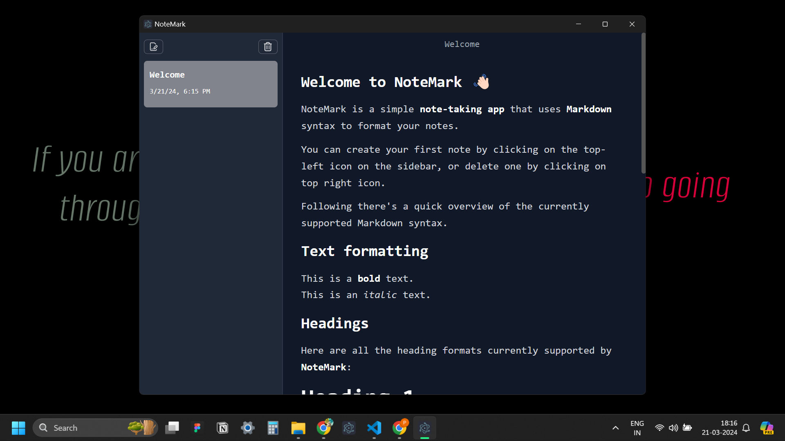

# note-mark

An Electron application with React and TypeScript. This application uses Jotai for state management. You can use this application to take notes using a Markdown Editor and save your notes locally.



## Project Setup

### Install

```bash
$ yarn
```

### Development

```bash
$ yarn dev
```

### Build

```bash
# For windows
$ yarn build:win

# For macOS
$ yarn build:mac

# For Linux
$ yarn build:linux
```

## Demo Video

[Watch the demo video of NoteMark](https://drive.google.com/drive/folders/1qydR5J0gLFTK8jbpbNechkLTs2v45h0p?usp=sharing)
